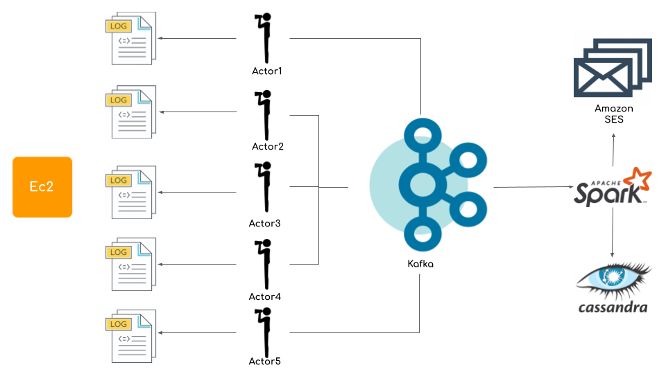
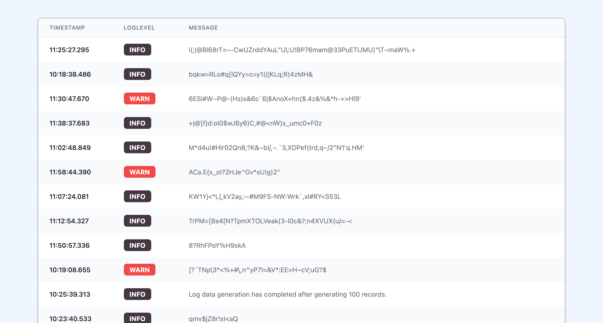

# Course Project
### The goal of this course project is to gain experience with creating a streaming data pipeline with cloud computing technologies by designing and implementing an actor-model service using [Akka](https://akka.io/) that ingests logfile generated data in real time and delivers it via an event-based service called [Kafka](https://kafka.apache.org/) to [Spark](https://spark.apache.org/) for further processing. This is a group project with each group consisting of one to six students. No student can participate in more than one group.
### Grade: 20%

## Authors
Andrea Cappelletti  
UIN: 674197701   
acappe2@uic.edu

Ajay Sagar  
UIN: 659867916  
anandi6@uic.edu

Cosimo Sguanci  
UIN: 670778611  
csguan2@uic.edu

Tru Nguyen  
UIN: 654073093  
tnguy276@uic.edu  

## Project
This repository is organized into 6 different subprojects.

- logGenerator
- MonitoringService
- Akka-Kafka
- Spark
- cloudFunctions
- logDashboard

The following sections describe the functionalities implemented in all of them.

## Youtube Playlist

The documentation of our project is available on YouTube.
We created a playlist in order to make the videos straightforward and divided by topic.

https://www.youtube.com/playlist?list=PLfVw8NwC6k6n98mxJDiFBDzHKwUklbhW0

## LogFileGenerator

The first project, logGenerator, provides an extension of the log generator coded by Professor Mark.

We have design the overall architecture following this schema



All the instances of the logGenerator will pack their own data, that are generated over multiple days, into a single log file. 

All the output log files of the instances will be store into a common folder <code>output</code>following the naming convention of output1.log for instance 1, output2.log for instance 2 ...  and so on.

For example, if we instanciate 3 logGenerators, our output directory tree will look like this

- output
	- output1.log
	- output2.log
	- output3.log


To run the logGenerator on a EC2 instance follow the steps described below.

It is mandatory that the instance you select has at least 2 cores.

First thing first, log into your AWS console and start a Linux EC2 instance.

In order to do that, select launch instance and select

<code>Amazon Linux 2 AMI (HVM), SSD Volume Type - ami-03ab7423a204da002 (64-bit x86) / ami-0fb4cfafeead46a44 (64-bit Arm)</code>

Select <code>64-bit (x86)</code> and then <code>t3.xlarge</code>.

Make sure that SSH is enabled under security groups <code>SSH TCP 22 0.0.0.0/0 </code> and add your keypair when asked.

Now you should be able to login into your EC2 instance via SSH

In order to do so, run the command

```shell
ssh -i "linux.pem" ec2-user@ec2-54-241-68-63.us-west-1.compute.amazonaws.com
```

Where <code>linux.pem</code> is the name of your key and

<code>ec2-user@ec2-54-241-68-63.us-west-1.compute.amazonaws.com</code>

is the address of your instance.


Once you log in into your instance, in order to run the logGenerator you have to install
- Java SDK 8
- Scala
- SBT


### Install Java

To install Java, run the following command

```shell
sudo yum install java-1.8.0-openjdk
```
You may encounter the following error while running yum
```shell
File contains no section headers. file: file:///etc/yum.repos.d/bintray-sbt-rpm.repo
```
If you encounter that error, run
Solution
```shell
rm /etc/yum.repos.d/bintray-sbt-rpm.repo
```
In order to solve it, the go ahed and install Scala and SBT

### Install Scala

```shell
wget http://downloads.lightbend.com/scala/2.11.8/scala-2.11.8.rpm
sudo yum install scala-2.11.8.rpm
```
### Install sbt
```shell
curl -L https://www.scala-sbt.org/sbt-rpm.repo > sbt-rpm.repo
sudo mv sbt-rpm.repo /etc/yum.repos.d/
sudo yum install sbt
```

Now that we installed all the requirements to run the logGenerator, we are ready to run multiple instances of the logGenerator on our EC2 instance we can launch the script under the <code>jar</code> folder named <code>launch.sh</code>.


```bash
#!/bin/bash

echo 'Welcome! Please insert the number of instance I have to generate'

read instances

echo 'Okay, I will run {$instances} instances'

for i in $(seq 1 $instances);
do
    output_dir="output${i}.log"
    echo 'Running instance number' $i
    nohup java -jar logGenerator.jar $output_dir &
done

```

To run it, first we have to give it the right permission

```bash
chmod +x launch.sh
```
Please make sure that the script and the jar <code>logGenerator.jar</code> are in the same directory.

Now, we can run the script

```bash
./launch.sh
```

The script will ask us how many instances of the logGenerator we would like to run. 
Once we provide the number, it will automatically instanciate them for us in background.

If you want to stop the instances running you have to identify their PID (process identifier). In order to do that run 

```bash
lsof logGenerator.jar
```

Once you have identified the PIDs, you can stop the process running

```bash
kill PID
```

Where PID is the process identifier of the logGenerator instance.

### YouTube Video

A video explanation is available at this url: https://youtu.be/-hoUyyI6AZU


## MonitoringService

The `MonitoringService` is composed by the Akka actors that are constantly looking for changes in the log files using the Java NIO technology.

Based on a parameter that can be configured in the `application.conf` file, the idea is to instantiate one actor for each Log Generator, thus having one Akka actor for each log file that has to be monitored. The parameters that have to be configured are the following:

```
monitoringService {
    numOfLogGeneratorInstances = 2 # Should be equal to the number of deployed Log Generator instances
    basePath = "" # Contains the ABSOLUTE base path corresponding to the directory containing log files
    singleTimeWindow = false # if TRUE, consider the same time window for all the monitored log files
    timeWindows = [
        {
            start = "11:12:00"
            end = "11:25:00.999"
        },
        {
            start = "11:44:28"
            end = "11:44:28.999"
        },
    ],
    redisKeyLastTimeStamp = "LAST-TIMESTAMP"
    lineSeparator = " "
    redisHost = "localhost"
    redisPort = 6379
}
```

As we can see, the base path corresponding to the directory that Akka actors are tracking for changes. In addition, it is necessary to configure the time windows that we want to consider when we are searching in log files in response to changes.

By setting `singleTimeWindow` to `false`, it's possible to set different monitored time windows for different log files, in order to have more flexibility in the performed monitoring.

Every time a log file is updated, the corresponding Akka actor reacts to it and the last timestamp that has already been passed to the Kafka component for the specific log file is stored in a local Redis instance. 
This allows us to stop and restart the `MonitoringService` without notifying again the Kafka component about logs that were already been streamed before. 
This means that the Redis Instance will contain N keys `LAST-TIMESTAMP-output1.log, LAST_TIMESTAMP-output2.log, ...`, with N that is the number of log files that are being monitored.

### Installation Instructions
- In addition to the JDK, the `MonitoringService` component requires the installation of Redis, that can be installed following the instruction on the official website: https://redis.io/topics/quickstart
- Generate the JAR file for the `MonitoringService` with the following command:
```
sbt assembly
```

The default path of the generated JAR file is `target/LogMonitorService.jar` path.

### Instructions for running the MonitoringService
- The first step is to run the `LogGenerator` component as explained in the previous section
- Then, we have to start Redis by running the `redis-server` command
- Finally, we can start the `MonitoringService` application with the following command:
  
```
java -jar LogMonitorServer.jar
```

### YouTube Video

A video explaining the deployment of this component to AWS EC2 can be found at the following URL: https://youtu.be/AEMJd9joD1A

## AWS MSK Cluster

In this project we will be using the AWS msk service to create a kafka cluster to which messages will be sent from the Log Monitor

Below are the steps to be followed to create a msk server and deploy the Log Monitor service:-
1. We first need to create a VPC that can house an instance of the Kafka cluster and the EC2 instances containing the Log monitor service.
2. From the AWS console navigate to the VPC service and click on "Launch VPC Wizard"
3. Follow the steps in the wizard, provide a name to the vpc and choose an appropriate availability zone and choose "Create VPC"
4. Once create keep track of the VPC ID of the new VPC created.

Next we will create multiple subnets for our VPC. We will have a total of 3 subnets, each of which will be used by a kafka broker. This allows us to have multiple instances of Kafka allowing high availability and fault tolerance.
1. From the VPC console, navigate into the subnets section. From the list of subnets copy the Route table value for the default subnet already present for the VPC
2. Add two more subnets to the VPC by providing ip addresses ```10.0.1.0/24``` and ```10.0.2.0/24``` respectively and adding the route table value copied in the previous step.
3. Make sure the availability zones for the subnets are in the same region, for eg: us-west-1a, us-west-1b, us-west-1c.

Next we will deploy our MSK cluster into our VPC using an IAC configuration file.

1. From the VPC console, navigate to the subnets tab and copy the subnetIds of the 3 subnets previously created.
2. Then navigate to the Security Groups tab and copy the security group id for the VPC.
3. We then use the values fron the previous steps to create a IAC configuration as shown below

```json
{
  "BrokerNodeGroupInfo": {
    "BrokerAZDistribution": "DEFAULT",
    "InstanceType": "kafka.t3.small",
    "ClientSubnets": [
      "subnet-08780635206a03cd4",
      "subnet-06638c73d903dccd4",
      "subnet-08c12b4cc32fb389b"
    ],
    "SecurityGroups": [
      "sg-0802d303bcf93c80c"
    ]
  },
  "ClusterName": "AWSKafkaCS441",
  "EncryptionInfo": {
    "EncryptionInTransit": {
      "InCluster": true,
      "ClientBroker": "TLS"
    }
  },
  "EnhancedMonitoring": "PER_TOPIC_PER_BROKER",
  "KafkaVersion": "2.2.1",
  "NumberOfBrokerNodes": 3
}
```
[clusterInfo](./clusterinfo.json)
4. Execute the following command to create the MSK cluster
```
aws kafka create-cluster --cli-input-json fileb://clusterinfo.json
```

Once the Msk cluster is created we now need to create an EC2 instance within our VPC that can house the monitoring service and produce messages to Kafka.

1. From the AWS console, navigate to the EC2 service and click on create a new instance.
2. Select the required instance type, in the configuration details under the network list, select the same VPC in which the MSK cluster was deployed on.
3. Enable Auto-assign Public IP and Launch the instance.
4. Next we navigate to the security tab for the EC2 instance and copy the security group of the newly created EC instance.
5. Next navigate to the VPC service and add a new inbound rule to the VPC to allow all traffic coming from the EC2 instance's security group. This will make sure the Monitoring service can publish messages directly to the MSK broker instance.

We now install the required dependencies in the EC2 instance to be able to produce messages to Kafka

1. SSH into the EC2 terminal and install Java.
2. Run the following commands to download and install Apache Kafka
```bash
wget https://archive.apache.org/dist/kafka/2.2.1/kafka_2.12-2.2.1.tgz
tar -xzf kafka_2.12-2.2.1.tgz
```
3. navigate to the ```kafka_2.12-2.2.1``` directory
4. Create a new Topic called Logs by running the following command.
```bash
bin/kafka-topics.sh --create --zookeeper ZookeeperConnectString --replication-factor 3 --partitions 1 --topic Logs
```
5. The ZookeeperConnectString can be found in the MSK AWS Console page -> View Client Information.
6. Next we need to configure JVM truststore to talk to the MSK cluster. To do this run the following command in the EC2 instance.
```bash
cp /usr/lib/jvm/JDKFolder/jre/lib/security/cacerts /tmp/kafka.client.truststore.jks
```

Finally, we clone an instance of the Log monitor to monitor and produce logs to the MSK cluster.

1. Clone this git repo into a directory in the EC2 instance.
2. Copy the bootstrap servers TLS string the AWS MSK cluster form the AWS console and add it to the application.conf file [application.conf](./MonitoringService/src/main/resources/application.conf) under the Kafka section.
3. Update the basepath attribute in the [application.conf](./MonitoringService/src/main/resources/application.conf) file to point to the folder where the logs are being generated into.
4. Navigate into MonitoringService and run the following command
```
sbt clean compile run
```
5. We are now running the Monitoring Service and any new updates to the log file will produce messages that will be sent to the AWS MSK Kafka cluster.

### YouTube Video

A video explanation is available at this url: https://www.youtube.com/watch?v=SkdAaIDedUk&list=PLfVw8NwC6k6n98mxJDiFBDzHKwUklbhW0&index=3&t=21s


## Spark-Streaming

In this project, we will be using EMR to run our spark-stream application and Amazon keyspace to save all the data 
about logs

### Steps on how to create and set-up EMR:

#### Create And Config EMR

1. Navigate to EMR and click create cluster and go to advanced Options
2. EMR released used for this project is: emr-5.33.1 (remember to check spark 2.4.7)
3. Choose the same network VPC as Kafka above
4. Chose a name and spin off an EMR cluster

#### setup inbound and authorization between EMR and Kafka

1. Go to kafka cluster click on Networking > Security group
2. Copy the security group for EMR master (make sure it's not slave)
3. Add inbound with type: **All traffic** and paste in the EMR security group as source and save
4. Add **AmazonMSKFullAccess** to the default role for EMR when creating it **EMR_EC2_DefaultRole**,
or add to the role that associate with the EMR master node
5. Since MSK talk through SSL, you need get the generated kafka.client.truststore.jks when
creating kafka, with the default password as "changeit" and put it in application.conf

### Steps on how to create and set-up Amazon Keyspace:

#### Create Amazon Keyspace 

1. Navigate To Amazon Keyspace
2. From the left-hand side Click on Keyspace and create a keyspace (log_gen_keyspace is the project's keyspace)
3. From the left-hand side Click on table and create table with the below schema (log_data is the project's table)
4. Set up keyspace and table in Spark project by going to src/main/resource/application.conf

```
Amazon Keyspace Table Schema

file_name	text
log_id		uuid
log_message	text
log_type	text
timestamp	text
```

#### Set up connection to amazon keyspace


1. Create an IAM user
2. Add **AmazonKeyspacesFullAccess** to its permission
3. click on **Security credentials** and scroll to the bottom and generate credential for Amazon Keyspace
4. Insert new generated credential into **advanced.auth-provider.username** and **advanced.auth-provider.password**
5. use **https://docs.aws.amazon.com/keyspaces/latest/devguide/programmatic.endpoints.html** to figure out the region
for Amazon keyspace endpoint and replace it into basic.* and advanced.auth-provider.aws-region
6. for ssl-engine-factory generate as below and put the truststore path and password correctly
7. keep **class** configuration the same, do not change

```
curl https://certs.secureserver.net/repository/sf-class2-root.crt -O
openssl x509 -outform der -in sf-class2-root.crt -out temp_file.der
keytool -import -alias cassandra -keystore cassandra_truststore.jks -file temp_file.der

For more informaion about amazon keyspace TLS:
https://docs.aws.amazon.com/keyspaces/latest/devguide/using_java_driver.html#using_java_driver.BeforeYouBegin
```

> NOTE: you can simply skip step 6 and use the generated cassandra_truststore.jks from the project in **src/main/resource**

### Deploy and Run

1. From Spark Project, run: sbt assembly
2. after jar file created, upload it to the master node in EMR using ssh
3. make sure to upload both **cassandra_truststore.jks** and **kafka.client.truststore.jks**
and put it in the same directory as the jar file
4. Run the following command to remove signed jar problems

```bash
zip -d <jar file name>.jar META-INF/*.RSA META-INF/*.DSA META-INF/*.SF
```

5. then run spark-submit via the following:

```bash
spark-submit --master local[1] \
class SparkConsumer \ 
SparkConsumer.jar
 ```


 ### YouTube Video

A video explanation is available at this url: https://www.youtube.com/watch?v=LJEnlwDNrN8&list=PLfVw8NwC6k6n98mxJDiFBDzHKwUklbhW0&index=4


 ## cloudFunctions

 This project contains the backend for the following project (logDashboard).
 
 The backend is developed in Node Js and it's goal is to retrieve the log data from Cassandra and provide an API to the logDashboard. 

 We have deployed the entire project on Google Cloud because it was straightforward to integrate dependecies into the function with NPM (like Cassandra driver, aws auth ...).

 The API is public and it can be accessed at this URL.

https://us-central1-nuklex-app.cloudfunctions.net/logDataFunction

 Just for simplicity we decided to provide the first 20 log messages. 
 
 In the future a pageble query can be implemented to retrieve all the log messages or a get request with the timestamps as time interval.

 ## logDashboard

 The goal of this project is to retrieve the log data stored from Spark into Cassandra through
 the Google Cloud Api Function. Once retrieved, it provides a dashboard useful to analyse data statistics and to visualize the status of the system at any time.

 The dashboard has been realised using Typescript and NextJs.

 For the purpose of the project we limit the data retrieval at the first 20 logs.

 In order to run the dashboard first you have to install all the project dependencies with NPM. 
 
 Run from the root directory of the project

```javascript
npm install
 ```

And then deploy it with

```javascript
npm run dev
 ```

The output should look like

```bash
> dashboard-logs@0.1.0 dev
> next dev

ready - started server on 0.0.0.0:3000, url: http://localhost:3000
info  - Using webpack 4. Reason: future.webpack5 option disabled https://nextjs.org/docs/messages/webpack5

warn - You have enabled the JIT engine which is currently in preview.
warn - Preview features are not covered by semver, may introduce breaking changes, and can change at any time.
event - compiled successfully
 ```
Now you can access the dashboard at the address specified by the output of the previous command.
In this case

```javascript
http://localhost:3000
 ```

The features provided by our dashboard are the following.

### Overall overview of the log data (frequency and time window)


### Filter the log messages based on the type (ERROR, DEBUG, INFO ...)


### Visualize the log frequency of a particular type


### Take a deep look into the time window in order to understand the status of the system


### Take a look at the log messages in order to understand more about them



## Programming technology
All the simulations has been written in Scala using a Functional Programming approach.

While writing the simulations the following best practices has been adopted

- Large usage of logging to understand the system status;


- Configuration libraries and files to provide input values for the simulations;


- No while or for loop is present, instead recursive functions are largely used into the project.


- Modular architecture (code is divided by module to enhance maintainability)

## References
In order to produce the result obtained the following documents and paper
have been consulted.

- https://leanpub.com/edocc
- https://www.vmware.com
- https://aws.amazon.com/emr/
- https://rockthejvm.com/
- https://databricks.gitbooks.io/databricks-spark-reference-applications/content/logs_analyzer/index.html
- https://www.confluent.io/resources/kafka-the-definitive-guide-v1/
- https://www.docker.com/